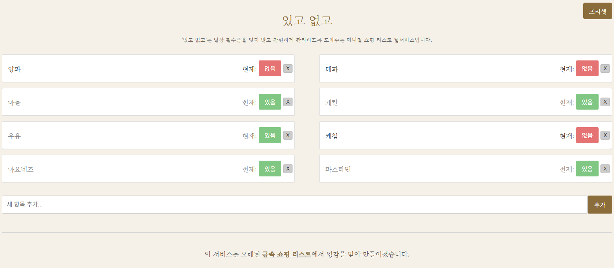

# 있고 없고 (Itgo Eopgo) - Vintage Shopping List



## 🔗 서비스 바로가기

[있고 없고 (Itgo Eopgo) 서비스](https://hojun313.github.io/Vintage-shopping-list/)

## 📝 프로젝트 소개

**일상의 필수품, 더 이상 잊지 마세요.**

'있고 없고'는 당신의 일상에 꼭 필요한 물건들을 간편하게 관리할 수 있도록 도와주는 미니멀 쇼핑 리스트 웹서비스입니다.

매번 마트에 갈 때마다 "뭘 사야 하더라?" 고민하셨나요?
냉장고 문을 열어보고 나서야 우유가 떨어진 걸 알게 된 적 없으신가요?

'있고 없고'와 함께라면 더 이상 그런 걱정은 끝.

---

## 핵심 기능

*   **On/Off, 그뿐:** 복잡한 기능은 모두 덜어냈습니다. 지금 나에게 '있는지' 또는 '없는지'만 간단하게 표시하세요.
*   **나만의 필수품 리스트:** 우유, 휴지, 샴푸처럼 주기적으로 구매해야 하는 물건들을 리스트에 추가하고 관리할 수 있습니다.
*   **두루뭉술한 관리:** "식료품"이나 "욕실용품"처럼 큰 범위로 항목을 설정하여 유연하게 사용할 수 있습니다. 마트에서 "식료품" 항목을 보며 필요한 것들을 떠올려 보세요.

## 어떻게 사용하나요?

1.  **리스트업:** 당신의 일상에 필요한 물건들을 등록하세요.
2.  **체크:** 물건이 다 떨어졌나요? '없고'로 상태를 변경하세요.
3.  **쇼핑:** 마트에서 '없고'로 표시된 물건들을 확인하고 장바구니에 담으세요.
4.  **리셋:** 장바구니에 담은 물건은 다시 '있고'로 변경하면 끝!

**'있고 없고'는 당신의 스마트한 소비 생활을 응원합니다.**

## 🛠️ 기술 스택

*   HTML5
*   CSS3
*   JavaScript (ES6+)

## 🚀 시작하기

1.  이 저장소를 클론합니다:
    ```bash
    git clone https://github.com/hojun313/Vintage-shopping-list.git
    ```
2.  클론된 디렉토리로 이동합니다:
    ```bash
    cd Vintage-shopping-list
    ```
3.  `index.html` 파일을 웹 브라우저에서 엽니다.

## 📄 라이선스

이 프로젝트는 MIT 라이선스에 따라 배포됩니다. 자세한 내용은 `LICENSE` 파일을 참조하십시오.